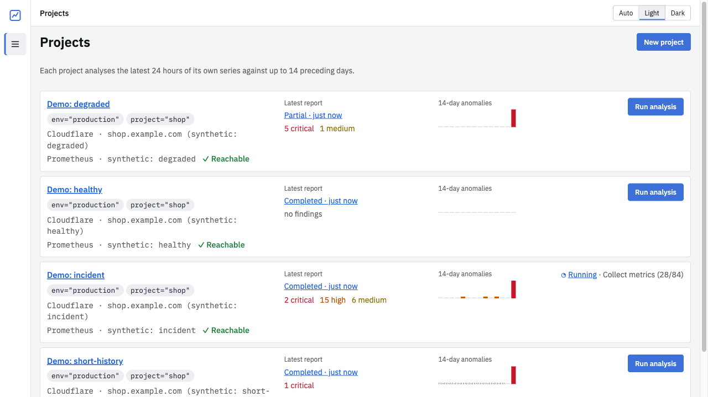

# DevOps Assistant

A local web assistant for one `project`/`env` scope of a Prometheus-compatible metrics source (verified against VictoriaMetrics). For that scope it:

- finds anomalies in the **latest 24 hours**, comparing them with up to 14 preceding days;
- shows a **14-day anomaly trend**;
- adds optional AI explanations (OpenAI first; the provider is replaceable).

It covers node exporter, cAdvisor, Docker Swarm, and OpenTelemetry HTTP/RPC metrics. Numerical findings never depend on AI, missing telemetry is never reported as healthy, and thresholds are diagnostic heuristics, not SLOs.




## Run

```sh
make up                            # Docker: http://127.0.0.1:8000
# or natively
make install && make serve          # http://127.0.0.1:8000
# offline demo with synthetic projects, no metrics source or API key
make demo
```

Configuration, Docker networking, backups, budgets and troubleshooting are in **[docs/OPERATIONS.md](docs/OPERATIONS.md)**. Copy `config.env.template` to `config.env` for settings such as `OPENAI_API_KEY` and `OPENAI_MODEL`.

Layout: `devops/docker/Dockerfile` builds the image, `tools/compose/compose.yml` runs it locally (through `make up`/`make down`/`make stop`/`make logs`). Run `make help` for all targets.

## Deploy with Docker Compose

A standalone `compose.yml` for a host that runs the assistant from a checkout of this repository. Put it in the repository root (or adjust `build.context`), next to a `.env` holding `OPENAI_API_KEY`/`OPENAI_MODEL`, and start it with `docker compose up -d --build`.

```yaml
services:
  assistant:
    image: ghcr.io/slapshin/devops-assistant:latest
    restart: unless-stopped
    ports:
      - "127.0.0.1:8000:8000"
    environment:
      AI_PROVIDER: ${AI_PROVIDER:-openai} # openai | none | fake
      OPENAI_API_KEY: ${OPENAI_API_KEY:-}
      OPENAI_MODEL: ${OPENAI_MODEL:-} # needs Structured Outputs support
      # Encrypts stored source credentials. Optional: by default a key is
      # generated in /data/secret.key, so back up the volume with the database.
      # SECRET_KEY: ${SECRET_KEY}
    volumes:
      - assistant-data:/data # SQLite database and secret.key

volumes:
  assistant-data:
```

The image has a built-in health check (`/api/health`); `docker compose ps` shows its state. Metrics sources are added per project in the UI. `docker compose down` keeps the `assistant-data` volume; `down -v` deletes all reports and projects. Backups and upgrades are in [docs/OPERATIONS.md](docs/OPERATIONS.md).

## Use

1. Create a project: a name, the label matchers that select its series (e.g. `project="shop"`, `env="prod"`), and its Prometheus-compatible source (URL and credentials, stored encrypted). Then **Analyze** it. Progress is shown per stage, and you can cancel.
2. **Overview**: severity counts, top findings, the AI explanation (hypotheses labelled unverified), and coverage and limitations.
3. **Findings**: filter, open the evidence (chart with the expected range, gaps and heuristic line; data table; exact query; related findings). Keys `j`/`k` move between findings and `Esc` closes the detail.
4. **Trends**: 14 daily buckets (anomalous share, episodes, minutes, entities, coverage). Select a day to see its episodes, and see which problems recur.
5. Saved reports reopen from **Recent reports** or their URL, including after a restart.

## Develop

```sh
make check          # ruff, mypy strict, pytest; contract and fixture drift; vue-tsc, eslint, vitest, build
make dev-backend    # :8000 (API docs at /api/docs)
make dev-frontend   # :5173, proxies /api
```

Docs: [release checklist](docs/RELEASE_CHECKLIST.md) · [plan](PLAN.md) · [product](docs/PRODUCT_PLAN.md) · [architecture](docs/ARCHITECTURE.md) · [decisions](docs/DECISIONS.md) · [UI spec](docs/UI_SPEC.md) · [contracts](docs/contracts.md) · [telemetry inventory](docs/telemetry-inventory.md) · [metrics catalog](docs/metrics-catalog.md) · [detection](docs/detection.md) · [tasks](docs/tasks/README.md)
