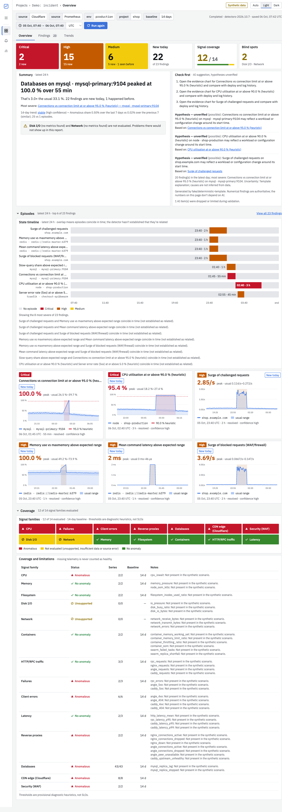

# DevOps AI Assistant

A local web assistant for one `project`/`env` scope of a Prometheus-compatible metrics source (verified against VictoriaMetrics). For that scope it:

- finds anomalies in the **latest 24 hours**, comparing them with up to 14 preceding days;
- shows a **14-day anomaly trend**;
- adds optional AI explanations (OpenAI first; the provider is replaceable).

It covers node exporter, cAdvisor, Docker Swarm, and OpenTelemetry HTTP/RPC metrics. Numerical findings never depend on AI, missing telemetry is never reported as healthy, and thresholds are diagnostic heuristics, not SLOs.



## Run

```sh
make up                            # Docker: http://127.0.0.1:8000, metrics at http://host.docker.internal:8428
# or natively
make install && make serve          # http://127.0.0.1:8000, metrics at http://localhost:8428
# offline demo, no metrics source or API key
METRICS_URL=synthetic://incident AI_PROVIDER=fake make up
```

Configuration, Docker networking, backups, budgets and troubleshooting are in **[docs/OPERATIONS.md](docs/OPERATIONS.md)**. Copy `config.env.template` to `config.env` for settings such as `OPENAI_API_KEY` and `OPENAI_MODEL`.

Layout: `devops/docker/Dockerfile` builds the image, `tools/compose/compose.yml` runs it locally (through `make up`/`make down`/`make stop`/`make logs`).

## Use

1. Choose a project and environment, then **Analyze**. Progress is shown per stage, and you can cancel.
2. **Overview**: severity counts, top findings, the AI explanation (hypotheses labelled unverified), and coverage and limitations.
3. **Findings**: filter, open the evidence (chart with the expected range, gaps and heuristic line; data table; exact query; related findings). Keys `j`/`k` move between findings and `Esc` closes the detail.
4. **Trends**: 14 daily buckets (anomalous share, episodes, minutes, entities, coverage). Select a day to see its episodes, and see which problems recur.
5. Saved reports reopen from **Recent reports** or their URL, including after a restart.

## Develop

```sh
make check          # ruff, mypy strict, pytest; contract and fixture drift; vue-tsc, eslint, vitest, build
make dev-backend    # :8000 (API docs at /api/docs)
make dev-frontend   # :5173, proxies /api
```

Docs: [release checklist](docs/RELEASE_CHECKLIST.md) · [plan](PLAN.md) · [product](docs/PRODUCT_PLAN.md) · [architecture](docs/ARCHITECTURE.md) · [decisions](docs/DECISIONS.md) · [UI spec](docs/UI_SPEC.md) · [contracts](docs/contracts.md) · [telemetry inventory](docs/telemetry-inventory.md) · [metrics catalog](docs/metrics-catalog.md) · [detection](docs/detection.md) · [tasks](docs/tasks/README.md)
